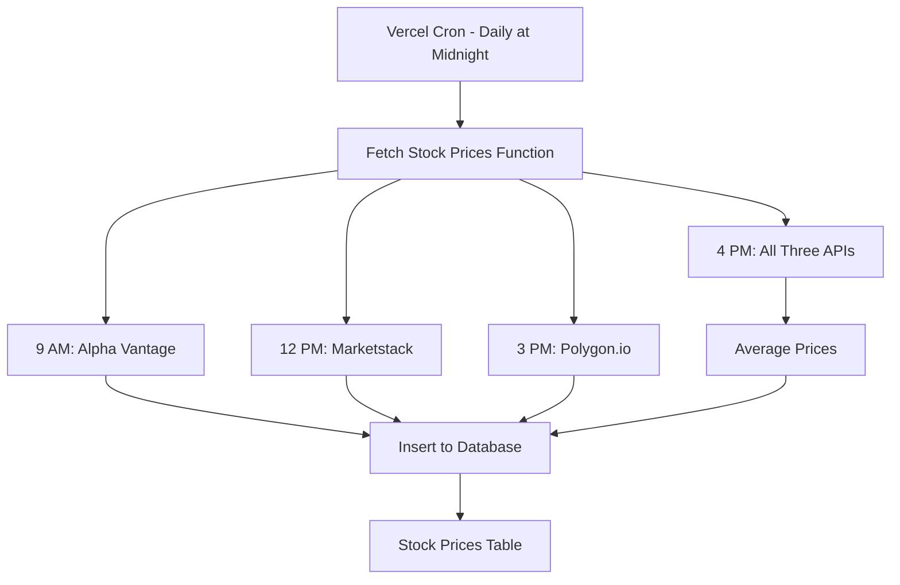

# Multi-API Stock Price Implementation

This document explains the multi-API stock price fetching system implemented in this project.

## Overview

The system now uses **four different data sources** to fetch stock prices throughout the trading day:

1. **Alpha Vantage** - Morning prices (9:00 AM EST / Market Open)
2. **Marketstack** - Midday prices (12:00 PM EST)
3. **Polygon.io** - Afternoon prices (3:00 PM EST)
4. **Averaged Data** - Market close (4:00 PM EST) - averages data from all three APIs

## Architecture

### API Client Libraries

Each API has its own client library in `/lib/`:

- **`lib/alphavantage.ts`** - Alpha Vantage API client
- **`lib/marketstack.ts`** - Marketstack API client
- **`lib/polygon.ts`** - Polygon.io API client
- **`lib/finnhub.ts`** - Finnhub API client (legacy, kept for backward compatibility)

All clients implement the same interface:
```typescript
interface StockData {
  ticker: string;
  companyName: string;
  price: number;
  change: number;
  changePercent: number;
  volume?: number;
  marketCap?: number;
  timestamp: Date;
  source: string; // NEW: tracks which API provided the data
}
```

### Rate Limiting

Each API client has built-in rate limiting to respect free tier limits:

| API | Free Tier Limit | Implementation Delay |
|-----|----------------|----------------------|
| **Alpha Vantage** | 25/day, 5/minute | 12 seconds between calls |
| **Marketstack** | 100/month, 1/minute | 60 seconds between calls |
| **Polygon.io** | 5/minute | 12 seconds between calls |
| **Finnhub** | 60/minute | 1.1 seconds between calls |

### Data Flow



## Database Schema

### Updated `stock_prices` Table

```sql
CREATE TABLE stock_prices (
  id UUID PRIMARY KEY DEFAULT gen_random_uuid(),
  ticker TEXT NOT NULL,
  company_name TEXT NOT NULL,
  price DECIMAL(12, 4) NOT NULL,
  change DECIMAL(12, 4),
  change_percent DECIMAL(8, 4),
  volume BIGINT,
  market_cap BIGINT,
  timestamp TIMESTAMP WITH TIME ZONE NOT NULL,
  created_at TIMESTAMP WITH TIME ZONE DEFAULT NOW(),
  source TEXT  -- NEW: alphavantage, marketstack, polygon, or averaged
);
```

### Indexes

- `idx_stock_prices_source` - Filter by data source
- `idx_stock_prices_ticker_source` - Composite index for ticker + source queries

## API Endpoints

### Environment Variables Required

Add these to your `.env` file:

```env
# Stock Price APIs
ALPHA_VANTAGE_API=your_alpha_vantage_key
MARKETSTACK_API=your_marketstack_key
POLYGON_API=your_polygon_key
FINNHUB_API=your_finnhub_key  # Optional, kept for backward compatibility
```

### Cron Job Endpoint

**`GET /api/cron/fetch-rss`**

This endpoint:
1. Fetches RSS news articles
2. Fetches stock prices from multiple APIs
3. Stores averaged data for market close
4. Cleans up old data

**Security:** Protected by `CRON_SECRET` environment variable

**Example Response:**
```json
{
  "success": true,
  "articlesAdded": 342,
  "stockPriceResults": [
    {
      "timestamp": "2025-01-22T09:00:00.000Z",
      "success": true,
      "stocksAdded": 18
    },
    {
      "timestamp": "2025-01-22T12:00:00.000Z",
      "success": true,
      "stocksAdded": 18
    },
    {
      "timestamp": "2025-01-22T15:00:00.000Z",
      "success": true,
      "stocksAdded": 18
    },
    {
      "timestamp": "2025-01-22T16:00:00.000Z",
      "success": true,
      "stocksAdded": 18
    }
  ]
}
```

### Stock Prices API

**`GET /api/stocks`**

The existing stocks API now supports filtering by source:

**Query Parameters:**
- `ticker` - Filter by stock ticker (e.g., AAPL)
- `source` - Filter by data source (alphavantage, marketstack, polygon, averaged)
- `start_date` - ISO 8601 date
- `end_date` - ISO 8601 date
- `limit` - Results per page
- `offset` - Pagination offset

**Examples:**
```bash
# Get all averaged (market close) prices for AAPL
curl "https://actually-free-api.vercel.app/api/stocks?ticker=AAPL&source=averaged"

# Get midday prices from Marketstack
curl "https://actually-free-api.vercel.app/api/stocks?source=marketstack"

# Get morning prices from Alpha Vantage for NVDA
curl "https://actually-free-api.vercel.app/api/stocks?ticker=NVDA&source=alphavantage"
```

## How Data Averaging Works

At 4:00 PM EST (market close), the system:

1. **Fetches from all 3 APIs in parallel** using `Promise.all()`
2. **Groups data by ticker**
3. **Calculates averages**:
   - Average price across all sources
   - Average change across all sources
   - Average change percent across all sources
   - Volume from the first available source
4. **Stores with source="averaged"**

### Example Averaging Calculation

```typescript
// Input data from 3 APIs for AAPL
Alpha Vantage: { price: 195.50, change: -2.10, changePercent: -1.06 }
Marketstack:   { price: 195.45, change: -2.15, changePercent: -1.09 }
Polygon:       { price: 195.48, change: -2.12, changePercent: -1.07 }

// Averaged output
{
  price: 195.4767,          // (195.50 + 195.45 + 195.48) / 3
  change: -2.1233,          // (-2.10 + -2.15 + -2.12) / 3
  changePercent: -1.0733,   // (-1.06 + -1.09 + -1.07) / 3
  source: "averaged"
}
```

## Benefits

### Data Redundancy
- If one API fails, others provide backup
- System continues to function even if 1-2 APIs are down

### Improved Accuracy
- Averaged prices at market close reduce API-specific anomalies
- Multiple data points provide confidence in price accuracy

### API Coverage Throughout Day
- Different APIs used at different times
- Spreads API quota usage across providers
- Reduces dependency on any single provider

### Cost Efficiency
- Uses free tiers of multiple APIs
- Daily cron job (free on Vercel)
- Smart rate limiting prevents exceeding quotas

## Migration Guide

To apply the database schema changes:

1. Run the migration SQL:
```sql
-- Execute migration-add-source-field.sql
ALTER TABLE stock_prices ADD COLUMN IF NOT EXISTS source TEXT;
CREATE INDEX IF NOT EXISTS idx_stock_prices_source ON stock_prices(source);
UPDATE stock_prices SET source = 'finnhub' WHERE source IS NULL;
```

2. Verify environment variables are set:
```bash
# Check .env file has all required API keys
ALPHA_VANTAGE_API=...
MARKETSTACK_API=...
POLYGON_API=...
```

3. Deploy to Vercel:
```bash
git add .
git commit -m "Implement multi-API stock price fetching"
git push
```

4. The next cron job run will use the new multi-API system automatically!

## Monitoring

### Check Logs

View cron job execution logs in Vercel dashboard:
1. Go to your deployment
2. Click "Functions"
3. Find `/api/cron/fetch-rss`
4. View execution logs

Look for messages like:
```
[market-open] Fetching stock prices using alphavantage...
[Alpha Vantage] Successfully fetched 18/18 stocks
✅ Added 18 stock prices for market-open from alphavantage

[midday] Fetching stock prices using marketstack...
[Marketstack] Successfully fetched 18/18 stocks
✅ Added 18 stock prices for midday from marketstack

[afternoon] Fetching stock prices using polygon...
[Polygon] Successfully fetched 18/18 stocks
✅ Added 18 stock prices for afternoon from polygon

[market-close] Fetching from all APIs for averaging...
Received: 18 from Alpha Vantage, 18 from Marketstack, 18 from Polygon
Created 18 averaged data points
✅ Added 18 stock prices for market-close from averaged
```

### Verify Data Quality

Query the database to check data sources:

```sql
-- Count records by source
SELECT source, COUNT(*) as count
FROM stock_prices
WHERE created_at > NOW() - INTERVAL '7 days'
GROUP BY source
ORDER BY count DESC;

-- Should show roughly equal counts for each source per day
```

## Troubleshooting

### Issue: Some APIs returning no data

**Possible Causes:**
- API key not set correctly
- Rate limit exceeded
- API is down
- Ticker symbol not supported by that API

**Solution:**
- Check environment variables
- Review API dashboard for quota usage
- Check API status pages
- Verify ticker symbols are valid for each exchange

### Issue: Averaged data has fewer stocks than individual APIs

**Possible Causes:**
- One or more APIs failed for specific tickers
- Ticker not available on all APIs

**Solution:**
- This is normal behavior - averaging only works for tickers with data from at least one API
- Check logs to see which API failed for which ticker
- Consider adding fallback logic if needed

### Issue: Build fails with "Cannot find module"

**Solution:**
```bash
npm install
npm run build
```

## Future Enhancements

Potential improvements to consider:

1. **Dynamic API Selection**
   - Choose best performing API automatically
   - Implement health checks for each API

2. **More Timeframes**
   - Add pre-market (6 AM) and after-hours (8 PM) data
   - Requires Vercel Pro for more frequent cron jobs

3. **Confidence Scoring**
   - Assign confidence scores based on API reliability
   - Weight averages by confidence

4. **API Fallback Chain**
   - Define primary, secondary, tertiary for each timeframe
   - Automatic failover if primary API fails

5. **Real-time WebSocket Integration**
   - Use Polygon.io WebSocket for truly real-time data
   - Supplement scheduled fetches with live updates

## Support

For issues or questions:
- Check the [GitHub Issues](https://github.com/mestrovicjozo/ActuallyFreeAPI/issues)
- Review API documentation for each provider
- Check Vercel cron job logs for detailed error messages
